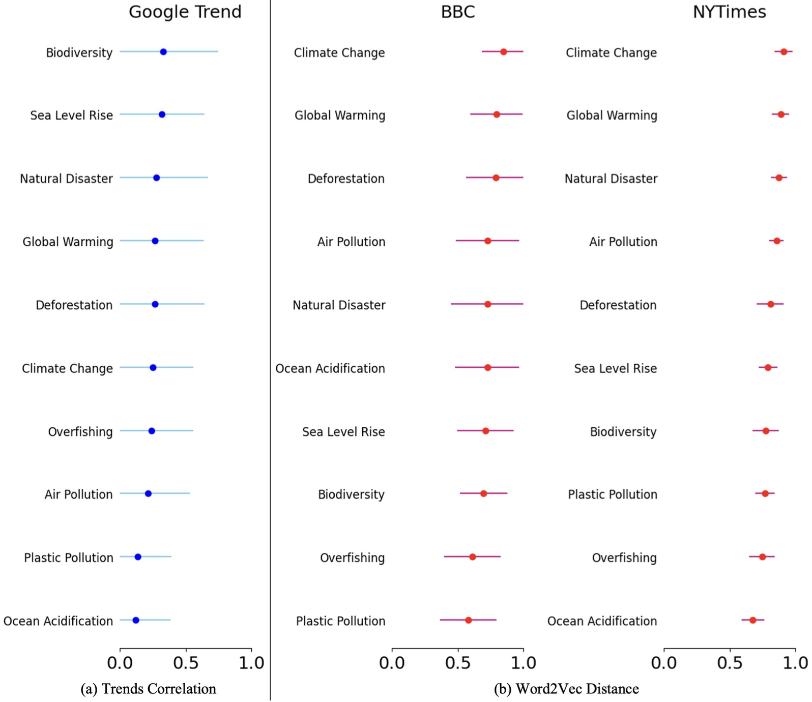

# Geoengineering-News

**Reference:** [*Deciphering public attention to geoengineering and climate issues using machine learning and dynamic analysis*](https://arxiv.org/pdf/2405.07010)

- Geoengineering-Explore.ipynb:  Explorative analysis

- Geoengineering-Sentiment.ipynb: Sentiment analysis

- Geoengineering-Topics.ipynb: Topic modelling

- Geoengineering-Correlation.ipynb: Correlation analysis

- Geoengineering-Causality.ipynb: Causality analysis

Use google drive to assure all codes are running in the right environment.

Put code file in the original folder and all data in /PPT/ directory, which leads to /PPT/data.csv

## Report bugs

Please report bugs to **tq224 \[at\] cam.ac.uk** with your sample code and data file. Much appreciated!